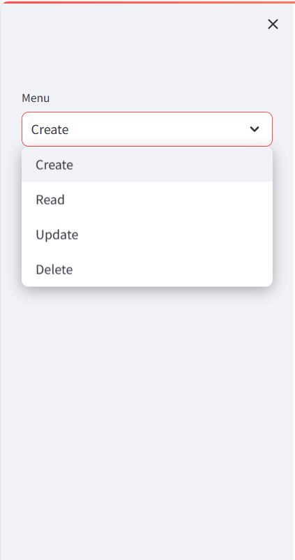
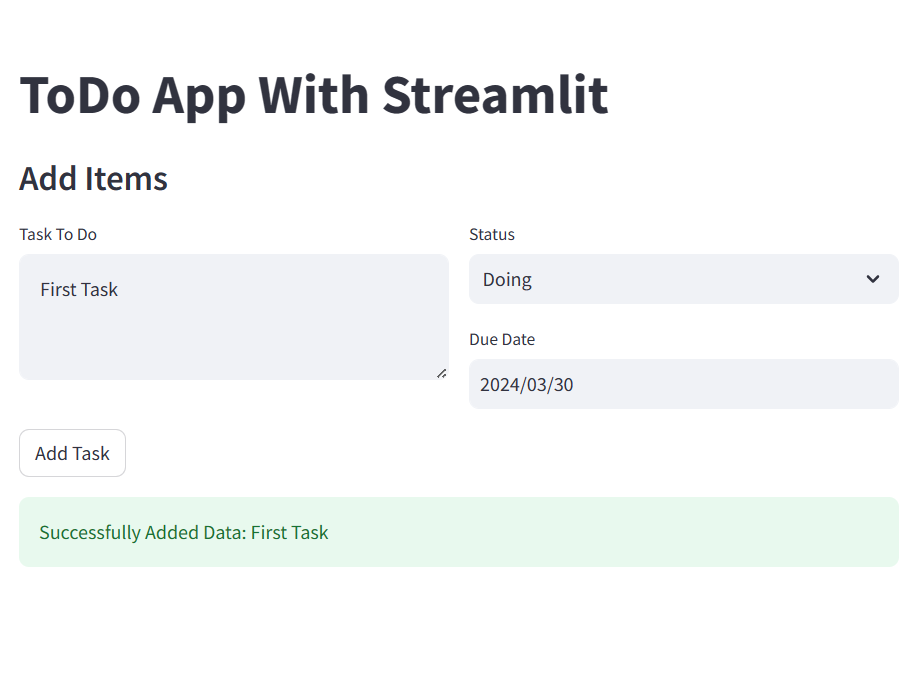
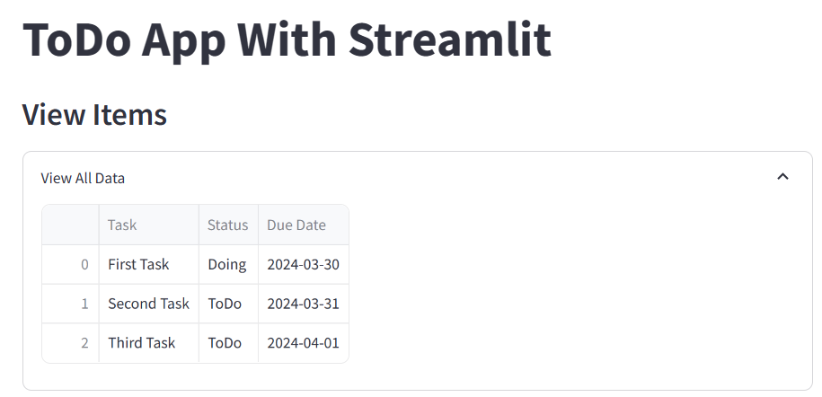
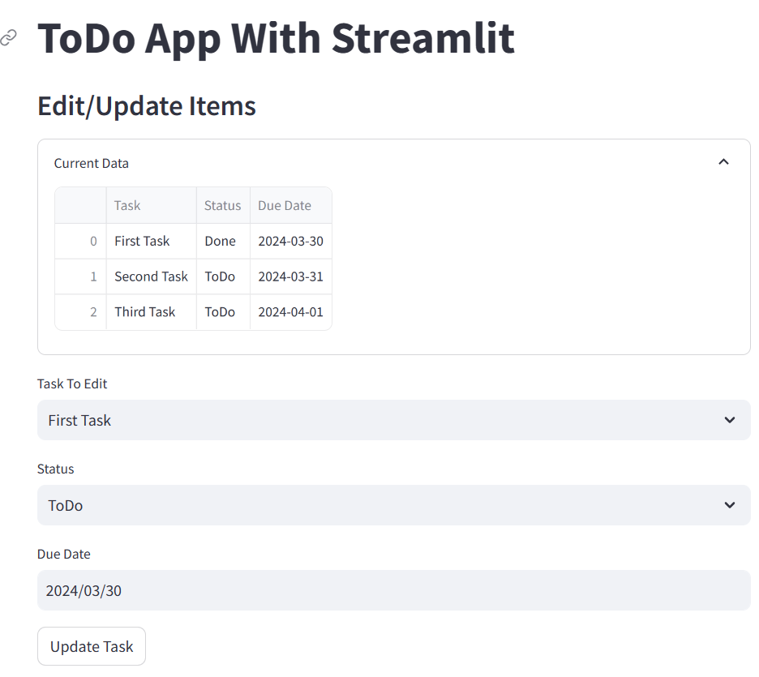
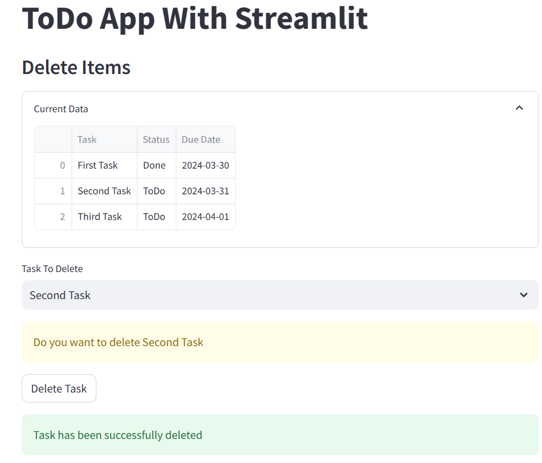

todo_app

# Todo App

A todo app, short for "to-do list" app, is a software application designed to help individuals or teams manage tasks, activities, and goals effectively. The primary purpose of a todo app is to assist users in organizing their responsibilities, prioritizing tasks, and tracking progress towards completing them.

**Todo app functions are:**
* Create
* Read
* Update 
* Delete

**Dropdown for the options**
```python
    st.title("ToDo App With Streamlit")

    menu=["Create","Read","Update","Delete"]
    choice=st.sidebar.selectbox("Menu",menu)
```
The code snippet sets up the main title of your Streamlit app and creates a sidebar menu with options for "Create," "Read," "Update," and "Delete" functionalities. When users interact with the sidebar, they can select an option from this menu to perform various actions within the todo app.

This structure allows users to navigate through different sections of the app easily, enabling them to add new tasks, view existing tasks, update task details, and delete tasks as needed. Each option in the sidebar corresponds to a specific functionality implemented within the app, providing a clear and intuitive user interface for managing tasks.



## Create

```python
# Define functions to interact with the database

def create_table():
    
    # Creates a table named 'taskstable' in the SQLite database if it doesn't exist already. 
    # The table has three columns: 'task' (text), 'task_status' (text), and 'task_due_date' (date).
    
    conn = sqlite3.connect('data.db')
    c = conn.cursor()
    c.execute('CREATE TABLE IF NOT EXISTS taskstable(task TEXT, task_status TEXT, task_due_date DATE)')
    conn.commit()
    conn.close()

```
The `create_table()` function is responsible for setting up the database structure required for storing tasks. It ensures that a table named 'taskstable' exists in the SQLite database (data.db) with columns for task description ('task'), task status ('task_status'), and task due date ('task_due_date'). If the table already exists, the function does nothing; otherwise, it creates the table. This function is essential for initializing the database schema before any tasks can be added, viewed, updated, or deleted.


```python
    if choice == "Create":
        st.subheader("Add Items")

        # Layout
        col1,col2 = st.columns(2)

        with col1:
            task = st.text_area("Task To Do")
    
        with col2:
            task_status = st.selectbox("Status",["ToDo","Doing","Done"])
            task_due_date = st.date_input("Due Date")

        if st.button("Add Task"):
            add_data(task, task_status, task_due_date)
            st.success("Successfully Added Data: {}".format(task))
```
In the "Create" section of the Streamlit app, users are presented with an interface to add new tasks. The layout consists of two columns, where users can input the task description (task), select the task status (task_status) from a dropdown menu (options include "ToDo", "Doing", "Done"), and specify the due date (task_due_date) using a date picker. Upon clicking the "Add Task" button, the `add_data()` function is called to insert the task details into the SQLite database. A success message is displayed to confirm the successful addition of the task. This section provides users with a convenient way to input new tasks into the todo app.

```
def add_data(task, task_status, task_due_date):
    conn = sqlite3.connect('data.db')
    c = conn.cursor()
    c.execute('INSERT INTO taskstable(task, task_status, task_due_date) VALUES (?, ?, ?)', (task, task_status, task_due_date))
    conn.commit()
    conn.close()
```

Adds a new task to the 'taskstable' table in the SQLite database.

Parameters:
*  task (str): The description of the task to be added.
*  task_status (str): The status of the task (e.g., "ToDo", "Doing", "Done").
*  task_due_date (str): The due date of the task in 'YYYY-MM-DD' format.

The `add_data()` function inserts a new task into the 'taskstable' table of the SQLite database. It takes three parameters:` task` (the description of the task), `task_status `(the status of the task), and `task_due_date `(the due date of the task). The function constructs an SQL query to insert these values into the appropriate columns of the table. After executing the query and committing the changes to the database, the connection is closed. This function facilitates the addition of tasks to the todo app's database.




## Read

```python
elif choice == "Read":
    st.subheader("View Items")
    result = view_all_data()
    if result:
        df = pd.DataFrame(result, columns=['Task', 'Status', 'Due Date'])
        with st.expander("View All Data"):
            st.dataframe(df)
        
        with st.expander("Task Status"):
            task_df = df['Status'].value_counts().to_frame()
            task_df = task_df.reset_index()
            st.dataframe(task_df)

            p1 = px.pie(task_df, names='Status', values='count')
            st.plotly_chart(p1)

    else:
        st.write("No tasks found.")
```

In the "Read" section of the Streamlit app, users can view the existing tasks stored in the database. If tasks are found, they are displayed in a DataFrame format with columns for task description, task status, and due date. Additionally, users can expand the "Task Status" section to view a pie chart representation of the task statuses, providing a visual breakdown of tasks based on their status categories (e.g., ToDo, Doing, Done). If no tasks are found in the database, a message indicating the absence of tasks is displayed. This section enables users to review their current tasks and gain insights into their task statuses through visualizations.

```python
def view_all_data():

    conn = sqlite3.connect('data.db')
    c = conn.cursor()
    c.execute('SELECT * FROM taskstable')
    data = c.fetchall()
    conn.close()
    return [row for row in data if row[0]]
```
    
Retrieves all data from the 'taskstable' table in the SQLite database.

Returns:
    list: A list of tuples containing the retrieved data, where each tuple represents a row from the table.
    
The `view_all_data()` function fetches all data stored in the 'taskstable' table of the SQLite database. It establishes a connection to the database, executes an SQL query to select all rows from the table, fetches the results, and then closes the connection. The function returns a list of tuples, where each tuple represents a row from the table. This function facilitates retrieving all tasks from the database, allowing users to view their entire task list within the Streamlit app.




## Update

```python
def update_data(task, new_task_status, new_task_due_date):
    
    conn = sqlite3.connect('data.db')
    c = conn.cursor()
    c.execute('UPDATE taskstable SET task_status=?, task_due_date=? WHERE task=?', (new_task_status, new_task_due_date, task))
    conn.commit()
    conn.close()
```

Updates the status and due date of a specific task in the 'taskstable' table of the SQLite database.

Parameters:
        task (str): The description of the task to be updated.
        new_task_status (str): The new status of the task (e.g., "ToDo", "Doing", "Done").
        new_task_due_date (str): The new due date of the task in 'YYYY-MM-DD' format.

Returns:
        None
    
The `update_data()` function modifies the status and due date of a specific task in the 'taskstable' table of the SQLite database. It takes three parameters: `task` (the description of the task to be updated), `new_task_status` (the new status of the task), and `new_task_due_date` (the new due date of the task). The function constructs an SQL query to update the respective columns of the table for the specified task. After executing the query and committing the changes to the database, the connection is closed. This function facilitates the updating of task statuses and due dates within the todo app.

```python
elif choice == "Update":
    st.subheader("Edit/Update Items")
    result = view_all_data()
    if result:
        df = pd.DataFrame(result, columns=['Task', 'Status', 'Due Date'])
        with st.expander("Current Data"):
            st.dataframe(df)

        list_of_tasks = [i[0] for i in view_unique_tasks()]
        selected_task = st.selectbox("Task To Edit", list_of_tasks)

        new_task_status = st.selectbox("Status", ["ToDo", "Doing", "Done"])
        new_task_due_date = st.date_input("Due Date")

        if st.button("Update Task"):
            update_data(selected_task, new_task_status, new_task_due_date)
            st.success("Task Updated Successfully")

    else:
        st.write("No tasks found.")
```

In the "Update" section of the Streamlit app, users are provided with an interface to edit or update existing tasks. If tasks are found in the database, they are displayed in a DataFrame format under the "Current Data" expander. Users can select the task they want to edit from a dropdown menu (`selected_task`). They can then update the task status (`new_task_status`) and due date (`new_task_due_date`) using respective select boxes and date input widgets. Upon clicking the "Update Task" button, the `update_data()` function is called to apply the changes to the selected task. A success message is displayed to confirm the successful update of the task. If no tasks are found in the database, a message indicating the absence of tasks is displayed. This section allows users to modify the status and due date of existing tasks within the Streamlit app.


```python
def view_unique_tasks():

    conn = sqlite3.connect('data.db')
    c = conn.cursor()
    c.execute('SELECT DISTINCT task FROM taskstable WHERE task IS NOT NULL AND task != ""')
    data = c.fetchall()
    conn.close()
    return data
```

Retrieves unique task descriptions from the 'taskstable' table in the SQLite database.

Returns:
        list: A list of unique task descriptions retrieved from the database.

The `view_unique_tasks()` function fetches unique task descriptions from the 'taskstable' table of the SQLite database. It establishes a connection to the database, executes an SQL query to select distinct task descriptions that are not null or empty, fetches the results, and then closes the connection. The function returns a list of unique task descriptions retrieved from the database. This function is useful for obtaining a list of tasks to populate dropdown menus or select boxes in the Streamlit app interface, ensuring that users can select existing tasks for editing or deletion.




## Delete

```python
def delete_data(task):

    conn = sqlite3.connect('data.db')
    c = conn.cursor()
    c.execute('DELETE FROM taskstable WHERE task=?', (task,))
    conn.commit()
    conn.close()
```

Deletes a specific task from the 'taskstable' table in the SQLite database.

Parameters:
        task (str): The description of the task to be deleted.

Returns:
        None

The `delete_data()` function removes a specific task from the 'taskstable' table of the SQLite database. It takes one parameter: `task` (the description of the task to be deleted). The function constructs an SQL query to delete the row corresponding to the specified task from the table. After executing the query and committing the changes to the database, the connection is closed. This function facilitates the deletion of tasks from the todo app's database.

```python
elif choice == "Delete":
    st.subheader("Delete Items")
    result = view_all_data()
    df = pd.DataFrame(result, columns=['Task', 'Status', 'Due Date'])
    with st.expander("Current Data"):
        st.dataframe(df)
    
    list_of_tasks = [i[0] for i in view_unique_tasks()]
    selected_task = st.selectbox("Task To Delete", list_of_tasks)
    st.warning("Do you want to delete {}".format(selected_task))
    if st.button("Delete Task"):
        delete_data(selected_task)
        st.success("Task has been successfully deleted")
```

In the "Delete" section of the Streamlit app, users are presented with an interface to remove specific tasks from the todo list. Initially, all tasks are displayed in a DataFrame format under the "Current Data" expander. Users can select the task they want to delete from a dropdown menu (`selected_task`). A warning message is displayed to confirm the user's intention to delete the selected task. If the user clicks the "Delete Task" button, the `delete_data()` function is called to delete the chosen task from the database. A success message is then shown to indicate that the task has been successfully deleted. This section provides users with a straightforward way to remove unwanted tasks from the todo app.

